# Strapi Core Architecture Guide

A comprehensive technical deep-dive into the Strapi headless CMS architecture, covering the monorepo structure, core systems, data flow, and extension points.

---

## Table of Contents

1. [Overview](#1-overview)
2. [Monorepo Structure](#2-monorepo-structure)
3. [Core Package Architecture](#3-core-package-architecture)
4. [Initialization Flow](#4-initialization-flow)
5. [Admin Panel Architecture](#5-admin-panel-architecture)
6. [Database Layer](#6-database-layer)
7. [API & Routing System](#7-api--routing-system)
8. [Plugin System](#8-plugin-system)
9. [Content Management](#9-content-management)
10. [Middleware Pipeline](#10-middleware-pipeline)
11. [Service Layer](#11-service-layer)
12. [Permission & Authentication](#12-permission--authentication)
13. [Extension Points](#13-extension-points)
14. [Data Flow Patterns](#14-data-flow-patterns)
15. [Build System](#15-build-system)

---

## 1. Overview

Strapi is an **open-source headless CMS** built with Node.js. It provides a customizable API and an intuitive admin panel for content management.

### Technology Stack

| Layer              | Technology                          |
| ------------------ | ----------------------------------- |
| Runtime            | Node.js 20.x - 24.x                 |
| HTTP Server        | Koa.js                              |
| Database           | Knex.js (PostgreSQL, MySQL, SQLite) |
| Frontend           | React 18, Redux Toolkit             |
| Build Tools        | Nx, Rollup, TypeScript              |
| Package Management | Yarn Workspaces + Lerna             |

### High-Level Architecture

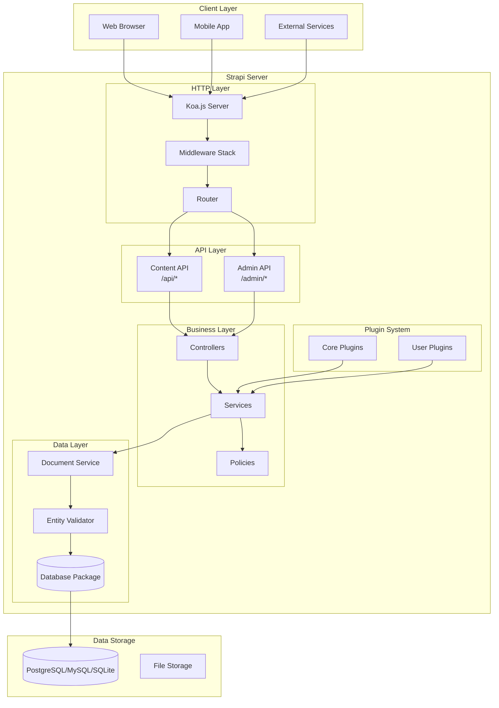

---

## 2. Monorepo Structure

Strapi uses a **Yarn workspaces monorepo** with Nx for task orchestration.

### Directory Layout

```
strapi/
├── packages/
│   ├── core/                    # Core framework packages
│   │   ├── strapi/             # Main entry point
│   │   ├── core/               # Core framework
│   │   ├── admin/              # Admin panel
│   │   ├── database/           # Database abstraction
│   │   ├── content-manager/    # Content editing UI
│   │   ├── content-type-builder/# Schema builder UI
│   │   ├── upload/             # File management
│   │   ├── email/              # Email service
│   │   ├── permissions/        # RBAC system
│   │   ├── types/              # TypeScript definitions
│   │   └── utils/              # Shared utilities
│   │
│   ├── plugins/                 # Official plugins
│   │   ├── graphql/
│   │   ├── i18n/
│   │   ├── users-permissions/
│   │   └── documentation/
│   │
│   ├── providers/               # Service providers
│   │   ├── email-*/
│   │   └── upload-*/
│   │
│   ├── cli/                     # CLI tools
│   │   ├── create-strapi/
│   │   └── create-strapi-app/
│   │
│   └── generators/              # Code generators
│
├── examples/                    # Example applications
│   ├── getstarted/             # Template app
│   └── kitchensink/            # Feature showcase
│
├── tests/                       # Integration & E2E tests
└── scripts/                     # Build scripts
```

### Package Categories

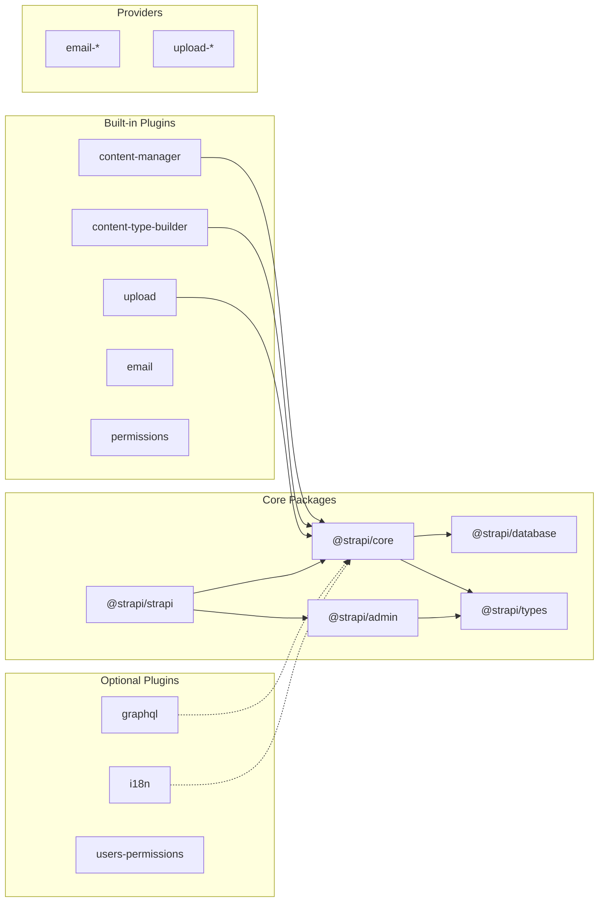

---

## 3. Core Package Architecture

### Main Entry Point (`@strapi/strapi`)

The main package serves as the entry point and CLI executable.

```
packages/core/strapi/
├── bin/strapi.js              # CLI executable
├── src/
│   ├── cli/                   # CLI commands (29+)
│   │   ├── commands/
│   │   │   ├── develop.ts
│   │   │   ├── build.ts
│   │   │   ├── start.ts
│   │   │   └── ...
│   │   └── index.ts
│   ├── index.ts               # Main exports
│   └── admin.ts               # Admin exports
└── package.json
```

### Core Framework (`@strapi/core`)

The heart of Strapi containing the main class and all core systems.

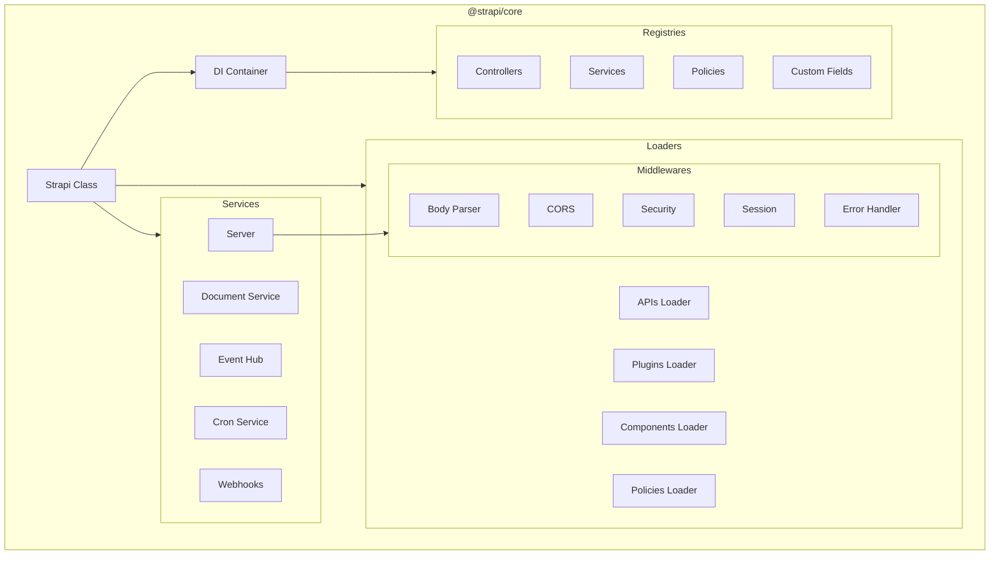

### Strapi Class Structure

```typescript
class Strapi extends Container implements Core.Strapi {
  // Core properties
  app: Koa; // HTTP server
  isLoaded: boolean = false;

  // Computed properties (getters)
  get admin(): Core.Module; // Admin module
  get EE(): boolean; // Enterprise Edition flag
  get dirs(): StrapiDirectories; // Directory paths
  get db(): Database; // Database instance
  get server(): Server; // HTTP server

  // Services
  get documentService(): DocumentService;
  get entityValidator(): EntityValidator;
  get customFields(): CustomFields;
  get eventHub(): EventHub;

  // Lifecycle
  async load(): Promise<Strapi>;
  async bootstrap(): Promise<void>;
  async destroy(): Promise<void>;

  // Registry accessors
  controller(uid: string): Controller;
  service(uid: string): Service;
  policy(uid: string): Policy;
  plugin(name: string): Plugin;
}
```

---

## 4. Initialization Flow

### Startup Sequence

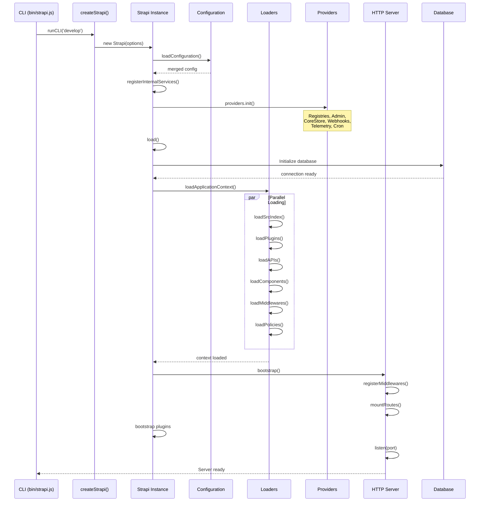

### Configuration Loading

Configuration is loaded from multiple sources and merged:

```mermaid
graph LR
    subgraph "Configuration Sources"
        ENV[.env file]
        ConfigDir[config/ directory]
        EnvOverrides[config/env/{NODE_ENV}/]
        Defaults[Default values]
    end

    subgraph "Merge Process"
        Load[Load & Merge]
        Compute[Compute URLs & Paths]
        Validate[Validate]
    end

    Result[Final Configuration]

    ENV --> Load
    ConfigDir --> Load
    EnvOverrides --> Load
    Defaults --> Load

    Load --> Compute
    Compute --> Validate
    Validate --> Result
```

**Configuration Structure:**

```javascript
// config/server.js
module.exports = {
  host: process.env.HOST || 'localhost',
  port: process.env.PORT || 1337,
  app: {
    keys: process.env.APP_KEYS.split(','),
  },
};

// config/database.js
module.exports = {
  connection: {
    client: 'postgres',
    connection: {
      host: process.env.DATABASE_HOST,
      port: process.env.DATABASE_PORT,
      database: process.env.DATABASE_NAME,
      user: process.env.DATABASE_USERNAME,
      password: process.env.DATABASE_PASSWORD,
    },
  },
};
```

---

## 5. Admin Panel Architecture

The admin panel is a **dual-stack package** with both server and client components.

### Structure

```
packages/core/admin/
├── server/src/                 # Backend (Koa)
│   ├── bootstrap.ts
│   ├── controllers/
│   ├── services/
│   ├── routes/
│   └── validation/
│
├── admin/src/                  # Frontend (React)
│   ├── App.tsx
│   ├── StrapiApp.tsx
│   ├── components/            # 38+ component directories
│   ├── pages/
│   ├── hooks/                 # 30+ custom hooks
│   ├── services/
│   ├── features/
│   └── translations/          # 39 languages
│
└── _internal/                  # Internal APIs
```

### Admin Frontend Architecture

```mermaid
graph TB
    subgraph "React Application"
        App[App.tsx]
        StrapiApp[StrapiApp.tsx]

        subgraph "State Management"
            Redux[Redux Store]
            RTK[RTK Query]
        end

        subgraph "Routing"
            Router[React Router v6]
            Routes[Route Config]
        end

        subgraph "UI Layer"
            DesignSystem[@strapi/design-system]
            Components[Custom Components]
            Pages[Page Views]
        end

        subgraph "Data Layer"
            Hooks[Custom Hooks]
            Services[API Services]
        end
    end

    App --> StrapiApp
    StrapiApp --> Redux
    StrapiApp --> Router

    Redux --> RTK
    Router --> Routes
    Routes --> Pages

    Pages --> Components
    Components --> DesignSystem

    Pages --> Hooks
    Hooks --> Services
    Services --> RTK
```

### Key Admin Components

| Component            | Purpose                      |
| -------------------- | ---------------------------- |
| `ContentManager`     | Data entry/editing interface |
| `ContentTypeBuilder` | Schema definition UI         |
| `MediaLibrary`       | File management              |
| `Settings`           | Configuration pages          |
| `RBAC`               | Role & permission management |

---

## 6. Database Layer

### Database Package Architecture

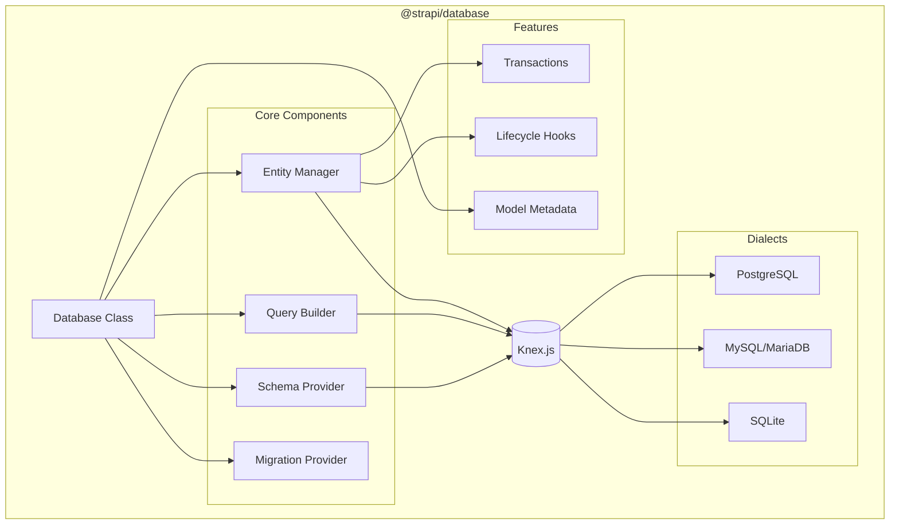

### Database Class Interface

```typescript
class Database {
  connection: Knex; // Knex instance
  dialect: Dialect; // Database-specific driver
  config: DatabaseConfig;
  metadata: Metadata; // Model registry
  schema: SchemaProvider; // Schema operations
  migrations: MigrationProvider; // Migration system
  lifecycles: LifecycleProvider; // Lifecycle hooks
  entityManager: EntityManager; // Entity operations

  // Query methods
  query(uid: string): Repository;
  queryBuilder(uid: string): QueryBuilder;
  transaction(): Promise<Transaction>;

  // Schema methods
  getConnection(): Knex;
  getSchemaConnection(): Knex.SchemaBuilder;
}
```

### Supported Field Types

| Strapi Type   | SQL Type (PostgreSQL) |
| ------------- | --------------------- |
| `string`      | `VARCHAR(255)`        |
| `text`        | `TEXT`                |
| `richtext`    | `TEXT`                |
| `integer`     | `INTEGER`             |
| `biginteger`  | `BIGINT`              |
| `float`       | `DOUBLE PRECISION`    |
| `decimal`     | `DECIMAL`             |
| `boolean`     | `BOOLEAN`             |
| `date`        | `DATE`                |
| `datetime`    | `TIMESTAMP`           |
| `json`        | `JSONB`               |
| `uid`         | `VARCHAR(255)`        |
| `enumeration` | `VARCHAR(255)`        |
| `media`       | Relation to `files`   |
| `relation`    | Foreign key           |

---

## 7. API & Routing System

### Server Architecture

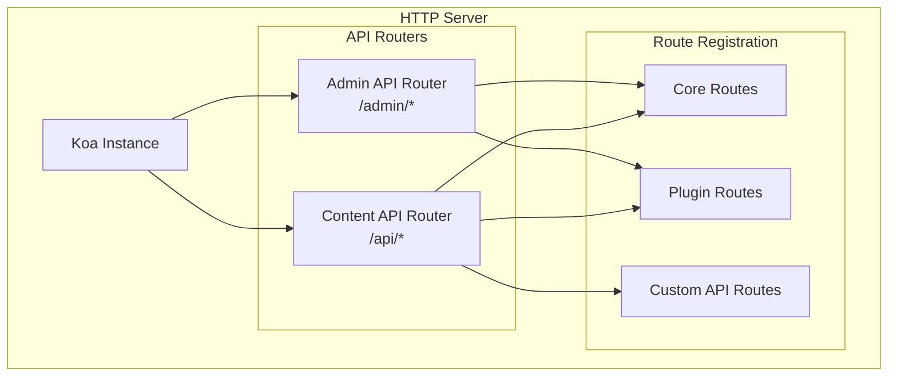

### Route Definition

```typescript
interface Route {
  method: 'GET' | 'POST' | 'PUT' | 'DELETE';
  path: string;
  handler: string; // 'controller.action'
  config?: {
    auth?: boolean | AuthConfig;
    policies?: string[];
    middlewares?: string[];
  };
}

// Example: src/api/article/routes/article.js
module.exports = {
  routes: [
    {
      method: 'GET',
      path: '/articles',
      handler: 'article.find',
    },
    {
      method: 'GET',
      path: '/articles/:id',
      handler: 'article.findOne',
    },
    {
      method: 'POST',
      path: '/articles',
      handler: 'article.create',
      config: {
        policies: ['is-authenticated'],
      },
    },
  ],
};
```

### Request Processing Flow

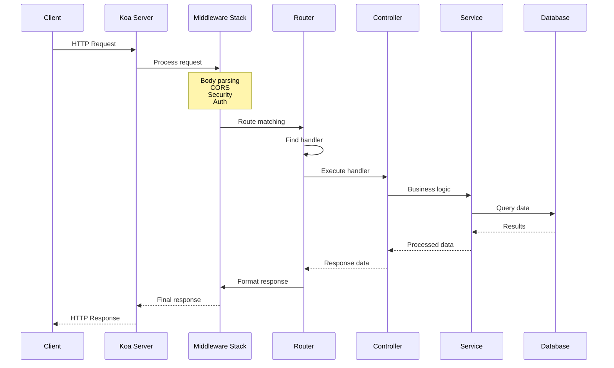

---

## 8. Plugin System

### Plugin Architecture

```mermaid
graph TB
    subgraph "Plugin Lifecycle"
        Discovery[Plugin Discovery]
        Loading[Plugin Loading]
        Register[register()]
        Bootstrap[bootstrap()]
        Runtime[Runtime]
        Destroy[destroy()]
    end

    subgraph "Plugin Components"
        Routes[Routes]
        Controllers[Controllers]
        Services[Services]
        Policies[Policies]
        Middlewares[Middlewares]
        ContentTypes[Content Types]
        AdminUI[Admin UI Extension]
    end

    Discovery --> Loading
    Loading --> Register
    Register --> Bootstrap
    Bootstrap --> Runtime
    Runtime --> Destroy

    Runtime --> Routes
    Runtime --> Controllers
    Runtime --> Services
    Runtime --> Policies
    Runtime --> Middlewares
    Runtime --> ContentTypes
    Runtime --> AdminUI
```

### Plugin Structure

```
my-plugin/
├── server/
│   └── src/
│       ├── index.ts           # Plugin entry point
│       ├── register.ts        # Registration logic
│       ├── bootstrap.ts       # Initialization
│       ├── destroy.ts         # Cleanup
│       ├── config/
│       │   └── default.ts
│       ├── routes/
│       │   └── index.ts
│       ├── controllers/
│       │   └── my-controller.ts
│       ├── services/
│       │   └── my-service.ts
│       ├── policies/
│       │   └── my-policy.ts
│       └── content-types/
│           └── my-type/
│               └── schema.json
│
├── admin/
│   └── src/
│       ├── index.tsx          # Admin plugin entry
│       ├── components/
│       └── pages/
│
├── strapi-server.js           # Server entry (CommonJS)
├── strapi-admin.js            # Admin entry (CommonJS)
└── package.json
```

### Plugin Interface

```typescript
interface Plugin {
  register(params: { strapi: Strapi }): void | Promise<void>;
  bootstrap(params: { strapi: Strapi }): void | Promise<void>;
  destroy(params: { strapi: Strapi }): void | Promise<void>;

  config?: {
    default: Record<string, unknown>;
    validator?: (config: unknown) => void;
  };

  routes?: Route[];
  controllers?: Record<string, Controller>;
  services?: Record<string, Service>;
  policies?: Record<string, Policy>;
  middlewares?: Record<string, Middleware>;
  contentTypes?: Record<string, ContentType>;
}
```

### Built-in Plugins

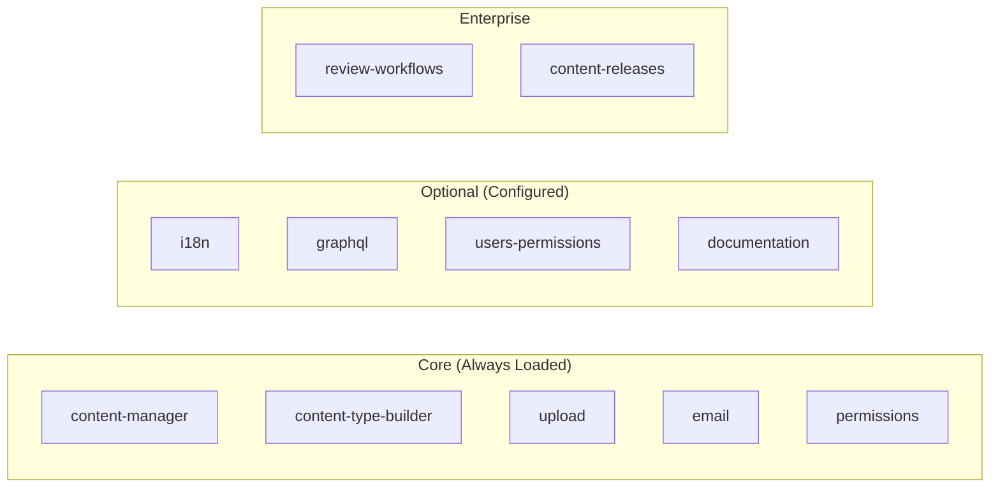

---

## 9. Content Management

### Content Manager Flow

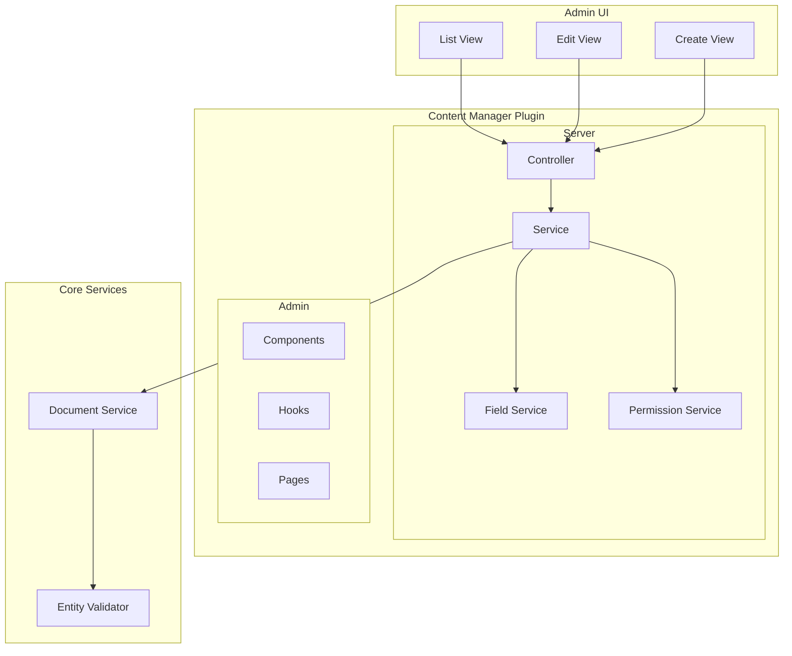

### Content Type Builder Flow

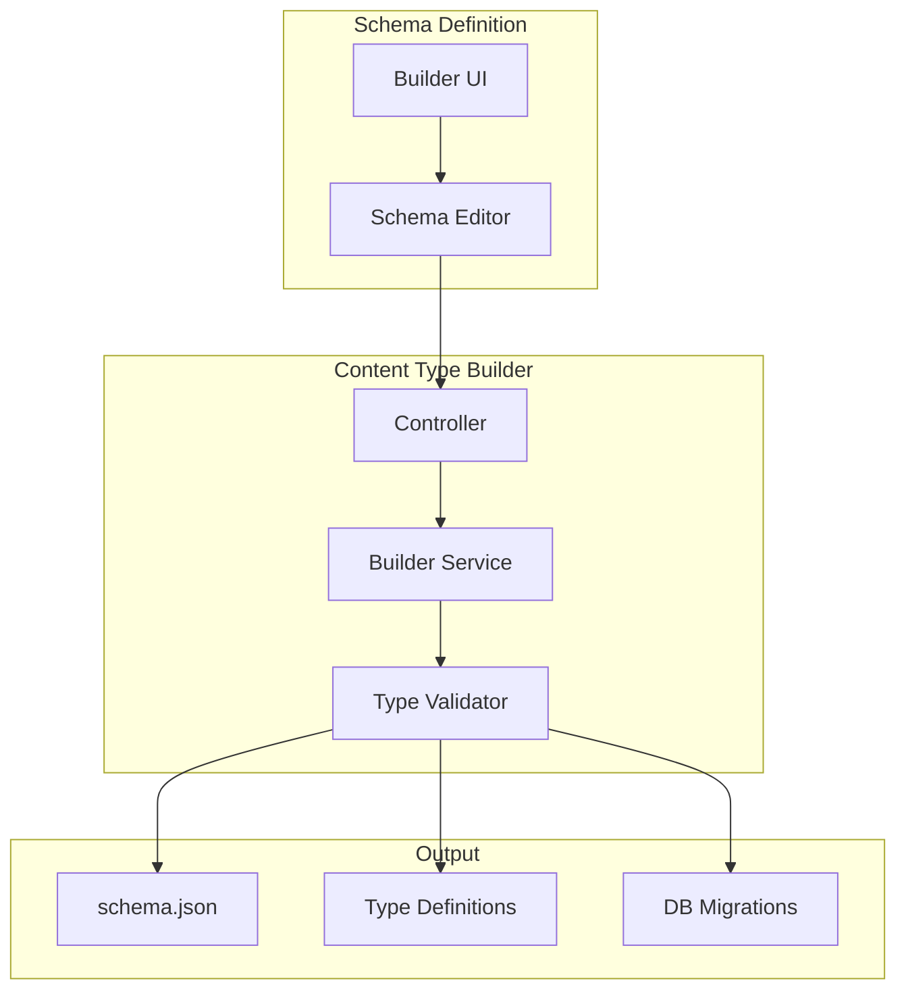

### Content Type Schema

```json
{
  "kind": "collectionType",
  "collectionName": "articles",
  "info": {
    "singularName": "article",
    "pluralName": "articles",
    "displayName": "Article"
  },
  "options": {
    "draftAndPublish": true
  },
  "attributes": {
    "title": {
      "type": "string",
      "required": true
    },
    "content": {
      "type": "richtext"
    },
    "slug": {
      "type": "uid",
      "targetField": "title"
    },
    "author": {
      "type": "relation",
      "relation": "manyToOne",
      "target": "api::author.author",
      "inversedBy": "articles"
    },
    "categories": {
      "type": "relation",
      "relation": "manyToMany",
      "target": "api::category.category"
    },
    "cover": {
      "type": "media",
      "allowedTypes": ["images"]
    }
  }
}
```

---

## 10. Middleware Pipeline

### Middleware Stack

```mermaid
graph TB
    subgraph "Request Pipeline"
        Request[Incoming Request]

        subgraph "Global Middlewares"
            ResponseTime[Response Time]
            Logger[Logger]
            Errors[Error Handler]
            Security[Security Headers]
            CORS[CORS]
            Body[Body Parser]
            Session[Session]
            Query[Query Parser]
            Public[Static Files]
        end

        subgraph "API Middlewares"
            Auth[Authentication]
            Policies[Policies]
            Custom[Custom Middlewares]
        end

        Handler[Route Handler]
        Response[Response]
    end

    Request --> ResponseTime
    ResponseTime --> Logger
    Logger --> Errors
    Errors --> Security
    Security --> CORS
    CORS --> Body
    Body --> Session
    Session --> Query
    Query --> Public
    Public --> Auth
    Auth --> Policies
    Policies --> Custom
    Custom --> Handler
    Handler --> Response
```

### Built-in Middlewares

| Middleware    | Purpose              | Package      |
| ------------- | -------------------- | ------------ |
| `body`        | Parse request body   | koa-body     |
| `cors`        | CORS headers         | @koa/cors    |
| `security`    | Security headers     | koa-helmet   |
| `session`     | Session management   | koa-session  |
| `compression` | Gzip compression     | koa-compress |
| `logger`      | Request logging      | Custom       |
| `errors`      | Error handling       | Custom       |
| `responses`   | Response formatting  | Custom       |
| `public`      | Static file serving  | koa-static   |
| `query`       | Query string parsing | qs           |

### Custom Middleware

```javascript
// src/middlewares/custom-logger.js
module.exports = (config, { strapi }) => {
  return async (ctx, next) => {
    const start = Date.now();

    await next();

    const duration = Date.now() - start;
    strapi.log.info(`${ctx.method} ${ctx.url} - ${duration}ms`);
  };
};

// config/middlewares.js
module.exports = [
  'strapi::errors',
  'strapi::security',
  'strapi::cors',
  {
    name: 'global::custom-logger',
    config: {},
  },
  'strapi::body',
  // ...
];
```

---

## 11. Service Layer

### Core Services

```mermaid
graph TB
    subgraph "Service Layer"
        DocumentService[Document Service]
        EntityValidator[Entity Validator]
        EventHub[Event Hub]
        Webhooks[Webhook Service]
        Cron[Cron Service]
        CoreStore[Core Store]
        CustomFields[Custom Fields]
    end

    subgraph "Document Service"
        Create[create()]
        FindOne[findOne()]
        FindMany[findMany()]
        Update[update()]
        Delete[delete()]
    end

    subgraph "Event System"
        Emit[emit()]
        Subscribe[on()]
        Unsubscribe[off()]
    end

    DocumentService --> Create
    DocumentService --> FindOne
    DocumentService --> FindMany
    DocumentService --> Update
    DocumentService --> Delete

    EventHub --> Emit
    EventHub --> Subscribe
    EventHub --> Unsubscribe

    DocumentService --> EventHub
    EventHub --> Webhooks
```

### Document Service API

```typescript
interface DocumentService {
  // Create
  create(uid: UID, options: CreateOptions): Promise<Document>;

  // Read
  findOne(uid: UID, documentId: ID, options?: FindOptions): Promise<Document>;
  findMany(uid: UID, options?: FindManyOptions): Promise<Document[]>;
  findFirst(uid: UID, options?: FindOptions): Promise<Document>;
  count(uid: UID, options?: CountOptions): Promise<number>;

  // Update
  update(uid: UID, documentId: ID, options: UpdateOptions): Promise<Document>;

  // Delete
  delete(uid: UID, documentId: ID, options?: DeleteOptions): Promise<Document>;

  // Bulk operations
  createMany(uid: UID, options: CreateManyOptions): Promise<Document[]>;
  updateMany(uid: UID, options: UpdateManyOptions): Promise<{ count: number }>;
  deleteMany(uid: UID, options: DeleteManyOptions): Promise<{ count: number }>;
}
```

### Event Hub

```javascript
// Subscribe to events
strapi.eventHub.on('entry.create', async (event) => {
  const { model, entry } = event;
  console.log(`Created ${model}:`, entry.id);
});

// Available events
const events = [
  'entry.create',
  'entry.update',
  'entry.delete',
  'entry.publish',
  'entry.unpublish',
  'media.create',
  'media.update',
  'media.delete',
];

// Emit custom events
strapi.eventHub.emit('custom.event', { data: 'value' });
```

---

## 12. Permission & Authentication

### Authentication Flow

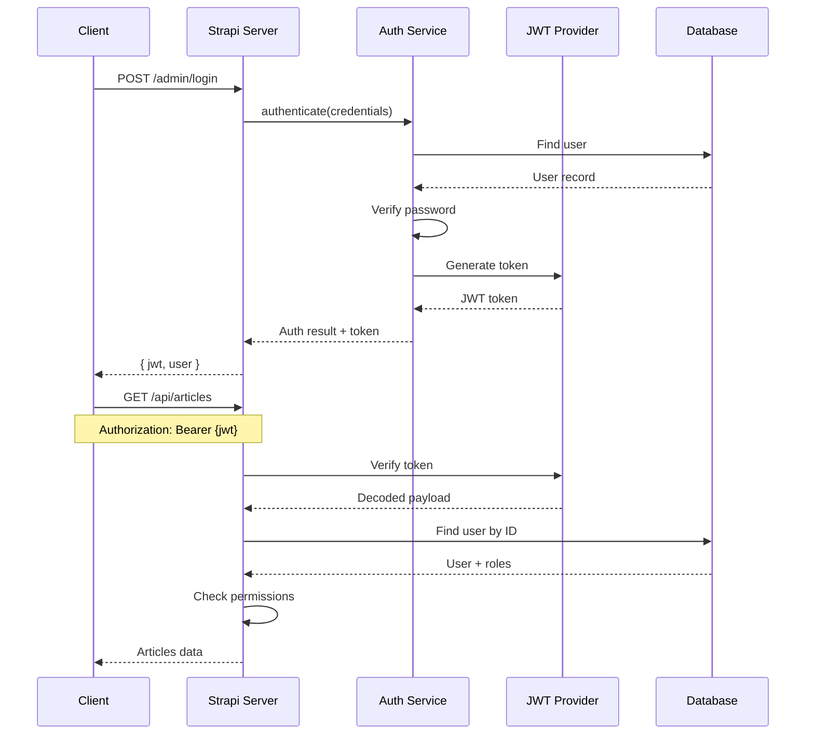

### RBAC Architecture

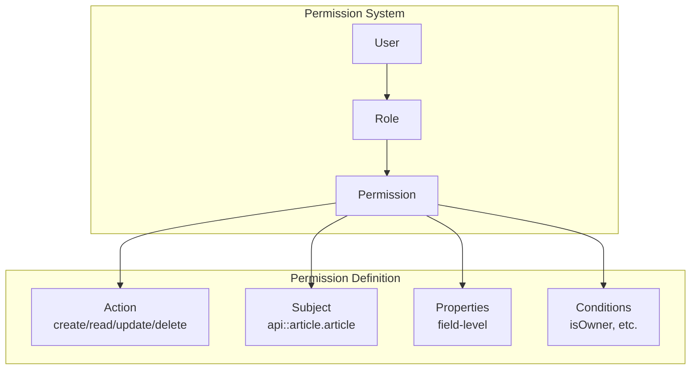

### Permission Structure

```typescript
interface Permission {
  id: number;
  action: string; // 'create', 'read', 'update', 'delete'
  subject: string | null; // 'api::article.article'
  properties: {
    fields?: string[]; // Allowed fields
    locales?: string[]; // Allowed locales (i18n)
  };
  conditions: string[]; // ['isOwner']
  role: Role;
}

interface Role {
  id: number;
  name: string;
  description: string;
  type: string; // 'super-admin', 'editor', 'author'
  permissions: Permission[];
}
```

### Policy Example

```javascript
// src/policies/is-owner.js
module.exports = async (policyContext, config, { strapi }) => {
    const { user } = policyContext.state;
    const { id } = policyContext.params;

    if (!user) {
        return false;
    }

    const article = await strapi.service('api::article.article')
        .findOne(id, { populate: ['author'] });

    return article?.author?.id === user.id;
};

// Usage in route
{
    method: 'PUT',
    path: '/articles/:id',
    handler: 'article.update',
    config: {
        policies: ['is-owner'],
    },
}
```

---

## 13. Extension Points

### Overview of Extension Points

```mermaid
graph TB
    subgraph "Extension Points"
        subgraph "Lifecycle Hooks"
            Register[register()]
            Bootstrap[bootstrap()]
            Destroy[destroy()]
        end

        subgraph "Content Lifecycles"
            BeforeCreate[beforeCreate]
            AfterCreate[afterCreate]
            BeforeUpdate[beforeUpdate]
            AfterUpdate[afterUpdate]
            BeforeDelete[beforeDelete]
            AfterDelete[afterDelete]
        end

        subgraph "Registries"
            Controllers[Custom Controllers]
            Services[Custom Services]
            Policies[Custom Policies]
            Middlewares[Custom Middlewares]
            Fields[Custom Fields]
        end

        subgraph "Events"
            EventHub[Event Subscriptions]
            Webhooks[Webhook Triggers]
        end
    end
```

### Application Lifecycle Hooks

```javascript
// src/index.js
module.exports = {
  /**
   * Called before Strapi boots
   * Use for: registering custom fields, extending schemas
   */
  register({ strapi }) {
    strapi.customFields.register({
      name: 'color',
      plugin: 'my-plugin',
      type: 'string',
    });
  },

  /**
   * Called after Strapi boots
   * Use for: running setup code, seeding data
   */
  async bootstrap({ strapi }) {
    const count = await strapi.db.query('api::article.article').count();
    if (count === 0) {
      await strapi.service('api::article.article').create({
        data: { title: 'Welcome!' },
      });
    }
  },

  /**
   * Called when Strapi shuts down
   * Use for: cleanup, closing connections
   */
  async destroy({ strapi }) {
    // Cleanup code
  },
};
```

### Content Type Lifecycles

```javascript
// src/api/article/content-types/article/lifecycles.js
module.exports = {
  async beforeCreate(event) {
    const { data } = event.params;
    // Modify data before creation
    data.slug = slugify(data.title);
  },

  async afterCreate(event) {
    const { result } = event;
    // Post-creation logic
    await notifySubscribers(result);
  },

  async beforeUpdate(event) {
    const { data, where } = event.params;
    // Validate or modify update
  },

  async afterUpdate(event) {
    const { result } = event;
    // Invalidate cache
    await cache.invalidate(`article:${result.id}`);
  },

  async beforeDelete(event) {
    const { where } = event.params;
    // Prevent deletion or cleanup
  },

  async afterDelete(event) {
    const { result } = event;
    // Cleanup related data
  },
};
```

### Registry Extensions

```javascript
// Extend existing controller
strapi.controller('api::article.article').customAction = async (ctx) => {
  // Custom logic
};

// Extend existing service
strapi.service('api::article.article').customMethod = async () => {
  // Custom logic
};

// Register custom policy
strapi.policies.add('custom-policy', (ctx, config) => {
  return true;
});
```

---

## 14. Data Flow Patterns

### Content Creation Flow

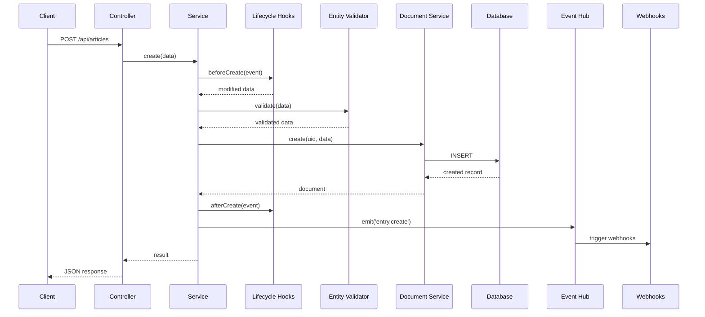

### Query & Population Flow

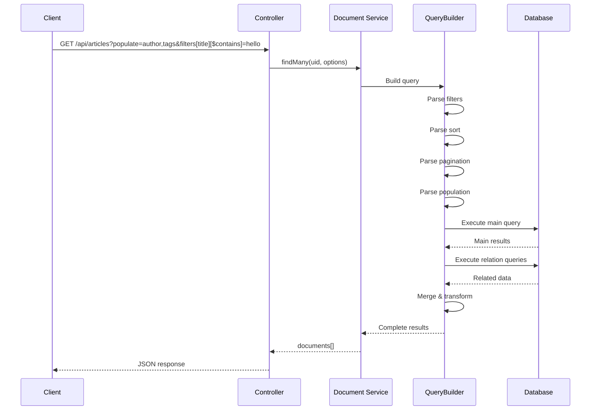

### API Request Parameters

```
GET /api/articles
    ?filters[title][$contains]=hello
    &filters[createdAt][$gte]=2024-01-01
    &sort[0]=title:asc
    &sort[1]=createdAt:desc
    &pagination[page]=1
    &pagination[pageSize]=25
    &populate[author][fields][0]=name
    &populate[tags]=*
    &fields[0]=title
    &fields[1]=content
    &publicationState=live
    &locale=en
```

---

## 15. Build System

### Build Architecture

```mermaid
graph TB
    subgraph "Build Tools"
        Nx[Nx Orchestrator]
        Rollup[Rollup Bundler]
        TypeScript[TypeScript Compiler]
        Babel[Babel/SWC]
        Vite[Vite Dev Server]
    end

    subgraph "Build Targets"
        Server[Server Bundle<br/>CommonJS + ESM]
        Admin[Admin Bundle<br/>React SPA]
        Types[Type Definitions<br/>.d.ts files]
    end

    subgraph "Output"
        Dist[dist/]
        Build[build/]
    end

    Nx --> Rollup
    Nx --> TypeScript
    Rollup --> Babel
    Rollup --> Server
    Vite --> Admin
    TypeScript --> Types

    Server --> Dist
    Admin --> Build
    Types --> Dist
```

### Build Commands

```bash
# Root level commands
yarn build              # Build all packages
yarn build:code        # Build code only (no types)
yarn build:types       # Build TypeScript declarations

# Development
yarn develop           # Start with hot reload
yarn watch             # Watch mode for packages

# Package level
yarn build             # Build single package
yarn build:watch      # Watch mode
```

### Output Structure

```
packages/core/strapi/dist/
├── index.js           # Main entry (CommonJS)
├── index.mjs          # ESM entry
├── index.d.ts         # Type definitions
├── cli/               # CLI compiled code
└── admin/             # Admin exports

packages/core/admin/build/
├── index.html         # SPA entry
├── assets/            # JS/CSS bundles
└── config.js          # Runtime config
```

---

## Summary

Strapi's architecture is built around these key principles:

1. **Modularity** - Plugin-based system for extensibility
2. **Flexibility** - Multiple databases, customizable APIs
3. **Developer Experience** - TypeScript, hot reload, clear patterns
4. **Scalability** - Event-driven, lifecycle hooks, caching support
5. **Security** - RBAC, policies, validation at multiple layers

The codebase demonstrates modern Node.js patterns with a clear separation between:

- **Core Framework** (`@strapi/core`) - Foundation and runtime
- **Admin Panel** (`@strapi/admin`) - React-based management UI
- **Database Layer** (`@strapi/database`) - Abstracted data access
- **Plugin System** - First-class extensibility

This architecture enables building custom headless CMS solutions while maintaining upgrade compatibility with the core framework.
